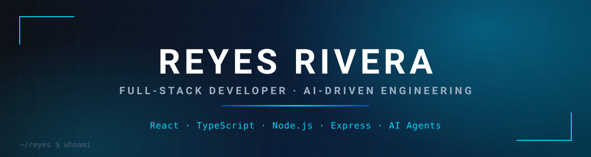

<div align="center">
  
</div>

<div align="center">
  
  
</div>

## 🎯 About Me

```ts
const reyes = {
  role: "Full-Stack Developer",
  location: "México 🇲🇽",

  building: [
    "SaaS products end to end",
    "AI-assisted development workflows",
  ],

  learning: [
    "Advanced TypeScript",
    "System Design",
    "AI Agents",
  ],

  tech: {
    frontend: ["React", "TypeScript"],
    backend: ["Node.js", "Express"],
    ai: ["AI agents", "automation"],
    database: ["MongoDB", "MySQL"],
  },

  languages: ["Español", "English"],
};
```

**EN** — I'm a full-stack developer focused on building SaaS products end to end: React + TypeScript on the frontend, Node.js + Express on the backend. I work with AI agents as part of my daily engineering workflow to design, build and ship software faster without giving up code quality.

**ES** — Soy desarrollador full-stack enfocado en construir productos SaaS de punta a punta: React + TypeScript en el frontend y Node.js + Express en el backend. Trabajo con agentes de IA como parte de mi flujo diario de ingeniería para entregar software más rápido sin sacrificar la calidad del código.

> *"Programs must be written for people to read, and only incidentally for machines to execute."*
> — Harold Abelson

## 🔗 Connect With Me

<div align="center">
  <a href="https://github.com/ReyesRivera11"></a>
  <a href="mailto:reyes.r4d@gmail.com"></a>
</div>

## 🛠️ Tech Stack

<div align="center">


</div>

## 📊 GitHub Analytics

<div align="center">


</div>

<div align="center">
  
</div>
